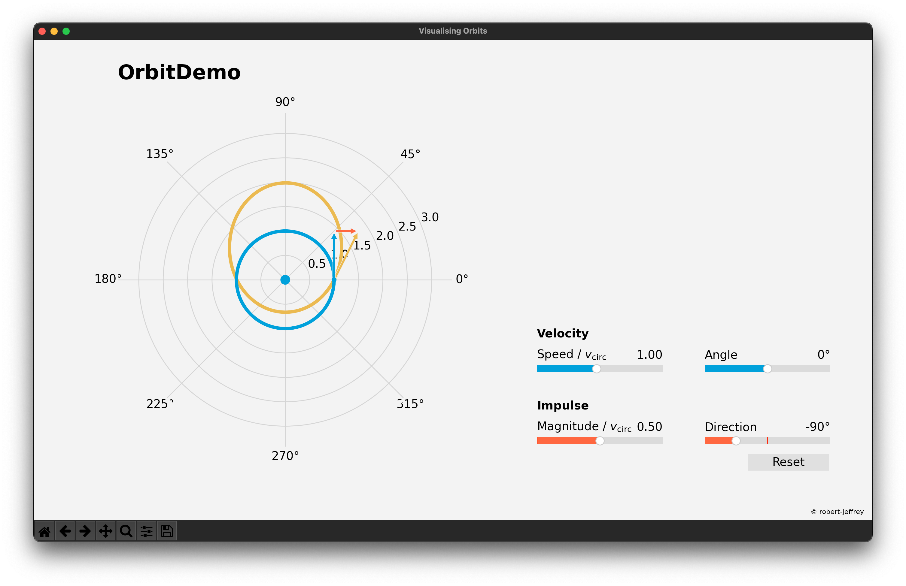

# orbit-demo
Visualisation toolkit for teaching orbital mechanics.

## Getting Started

To run the simulator:

* clone this repository, and

* run the simulator script directly from this directory: `python orbit-demo`.

You will need to have working installations of Matplotlib
([matplotlib.org](https://matplotlib.org)) and Numpy
([numpy.org](https://numpy.org)).